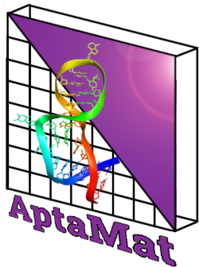

Purpose
-------------------

AptaMat is a simple script which aims to measure differences between DNA or RNA secondary structures. 
The method is based on the comparison of the matrices representing the two secondary structures to analyze, assimilable to dotplots. 
The dot-bracket notation of the structure is converted in a half binary matrix showing width equal to structure's length.
Each matrix case (i,j) is filled with '1' if the nucleotide in position i is paired with the nucleotide in position j, with '0' otherwise. 

The differences between matrices is calculated by applying Manhattan distance on each point in the template matrix 
against all the points from the compared matrix. This calculation is repeated between compared matrix and template
matrix to handle all the differences. Both calculation are then sum up with the number of gaps encountered and divided 
by the sum of all the points in both matrices.

AptaMat can handle extended dot-bracket notation and every additional bracket is converted into coordinates for the matrix.

AptaMat can also compare structures of different length. However, we recommend to work with structure of same length. Our 
algorithm includes gap understanding, where each gap is considered as an additional penalized unpaired nucleotide.

Dependencies
------------

AptaMat have been written in Python 3.8+

Two Python modules are needed :

- [NumPy](https://numpy.org/)
- [scipy](https://www.scipy.org/)

These can be installed by typing in the command prompt either :

    ./setup
or

    pip install numpy
    pip install scipy

Use of [Anaconda](https://docs.conda.io/en/latest/#) is highly recommended.

Usage
------------

AptaMat/AptaFast are flexible Python scripts which can take several arguments:

FOR APTAMAT:
- `-structures` followed by secondary structures written in dotbracket format
- `-weigths` (Optionnal) followed by weight values between 0 and 1 to indicate optionnal weight indices
- `-files` followed by path to formatted files containing one, or several secondary structures in dotbracket format
- `-ensemble`(Optionnal) which indicates whether the input secondary structures are part of an ensemble
- `-method` indicates the spatial distance method choose for AptaMat, by default cityblock and alternatively euclidean
ADDED FOR APTAFAST ONLY:
- `-speed` indicates the risk taken by the algorithm when calculating the searchg depth. (default: slow) Can be set to quick if the user is confident in its data.

      usage: AptaMat.py [-h] [-v] [-structures STRUCTURES [STRUCTURES ...]] [-weights WEIGHTS [WEIGHTS ...]] [-files FILES [FILES ...]] [-ensemble] [-method [{cityblock,euclidean}]]
      usage: AptaFast.py [-h] [-v] [-speed [{slow,quick}]] [-structures STRUCTURES [STRUCTURES ...]] [-weights WEIGHTS [WEIGHTS ...]] [-files FILES [FILES ...]] [-ensemble] [-method [{cityblock,euclidean}]]
      
Both `structures` and `files` are independent functions in the script and cannot be called at the same time.

The `structures` argument must be a string formatted secondary structures array. The first input structure is 
the template structure for the comparison. The following input are the compared structures. There are no input 
limitations. Quotes are necessary.

      usage: AptaMat.py -structures STRUCTURES [STRUCTURES ...]

The `weight` optionnal argument must be an array of float in 0 to 1 range showing identical size than input `structures` array. 
This argument is not compatible with `files` as the script is expecting this information to be in the input file. 

      usage: AptaMat.py -structures STRUCTURES [STRUCTURES ...] -weigths WEIGHTS [WEIGHTS ...]
    
    
The `files` argument must be a formatted file. Multiple files can be parsed. The first structure encountered 
during the parsing is used as the template structure. The others are the compared structures.

    
      usage: AptaMat.py -files FILES [FILES ...]
    

The input must be a text file, containing at least secondary structures, and accept additional 
information such as Title, Sequence, Structure index and Weight . If several files are provided, the function parses the files one
by one and always takes the first structure encountered as the template structure. Files must be formatted as follows: 

      >5HRU
      TCGATTGGATTGTGCCGGAAGTGCTGGCTCGA
      --Template--
      ((((.........(((((.....)))))))))
      [ weight ]
      --Compared--
      .........(((.(((((.....))))).)))
      [ weight ]
      ..........((.((((.......)))).)).
      [ weight ]

`ensemble` is an optionnal argument which allow to calculate AptaMat distance value for an ensemble of structure
instead of calculating pairwise distance.

      usage: AptaMat.py -structures STRUCTURES [STRUCTURES ...] -weigths WEIGHTS [WEIGHTS ...] -ensemble
          or
      usage: AptaMat.py -files FILES [FILES ...] -ensemble

Examples
------------

### structures function
First introducing a simple example with 2 structures:

      $ AptaMat.py -structures "(((...)))" "((.....))"
       (((...)))
       ((.....))
      > AptaMat : 0.4
    
Then, it is possible to input several structures:
    
      $ AptaMat.py -structures "(((...)))" "((.....))" ".(.....)." "(.......)"
      structure0 - structure1
       (((...)))
       ((.....))
      > AptaMat : 0.4
    
      structure0 - structure2
       (((...)))
       .(.....).
      > AptaMat : 1
    
      structure0 - structure3
       (((...)))
       (.......)
      > AptaMat : 1.5

### files function
Taking the above file example:

      $ AptaMat.py -files example.fa
      Template - Compared1
       ((((.........(((((.....)))))))))
       .........(((.(((((.....))))).)))
      > AptaMat:
        1.588235294117647

      Template - Compared2
       ((((.........(((((.....)))))))))
       ..........((.((((.......)))).)).
      > AptaMat:
        1.6666666666666667

### ensemble with input structures and weights
The four dotbracket used with `-structures` argument can be complete with `-weights` and `-ensemble`:

      $ AptaMat.py -structures "(((...)))" "((.....))" ".(.....)." "(.......)" -weights 0 0.5 0.3 0.2 -ensemble
    
      > AptaMat of structure set 
        0.8

### ensemble in file
This time, we consider the above file as an ensemble and we complete the structure informations with weights
      
      >5HRU
      TCGATTGGATTGTGCCGGAAGTGCTGGCTCGA
      --Template--
      ((((.........(((((.....)))))))))
      --Compared1--
      .........(((.(((((.....))))).)))
      [ 0.6 ]
      --Compared2--
      ..........((.((((.......)))).)).
      [ 0.4 ]

Here is the result:
      $ AptaMat.py -files example.fa
    
      > AptaMat of structure set 
        3.2549019607843137

Note
------------

Since AptaMat does not include automatic structure alignment, the choice of the software is up to the users.

Our papers observation have been made using Manhattan distance. Cutoff decision may be guided by the topic studied
and also by the choice of the distance method (Euclidean or Manhattan).

For the moment, no features have been included to check whether the base pair is able to exist or not, according 
to literature. You must be careful about the sequence input and the base pairing associated.

Citation
------------
If you are using AptaMat in your research, please support us by citing us : Thomas Binet, Bérangère Avalle, Miraine Dávila Felipe, Irene Maffucci, AptaMat: a matrix-based algorithm to compare single-stranded oligonucleotides secondary structures, Bioinformatics, Volume 39, Issue 1, January 2023, btac752, https://doi.org/10.1093/bioinformatics/btac752
