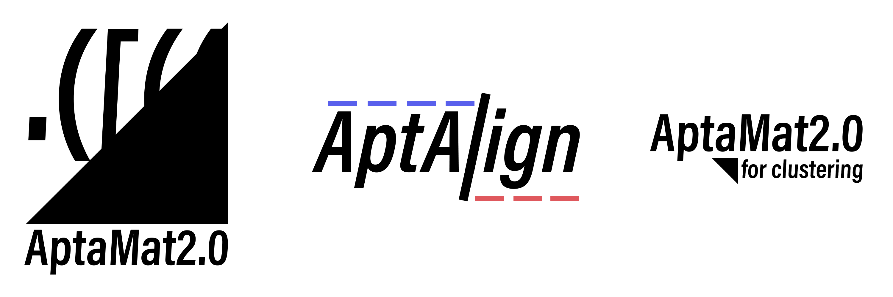

# Purpose

This repository host the AptaMat2.0, AptAlign and clustering algorithms based on the first version of AptaMat.
You can also find other scripts to convert datasets or generating ones randomly.

____

**AptaMat2.0** is a simple optimised script which aims to measure differences between DNA or RNA secondary structures. 
The method is based on the comparison of the matrices representing the two secondary structures to analyze, assimilable to dotplots. 
The dot-bracket notation of the structure is converted in a half binary matrix showing width equal to structure's length.
Each matrix case (i,j) is filled with '1' if the nucleotide in position i is paired with the nucleotide in position j, with '0' otherwise. 

The differences between matrices is calculated by applying Manhattan distance on each point in the template matrix 
against all the points from the compared matrix. This calculation is repeated between compared matrix and template
matrix to handle all the differences. Both calculation are then sum up with the number of gaps encountered and divided 
by the sum of all the points in both matrices.

AptaMat can handle extended dot-bracket notation and every additional bracket is converted into coordinates for the matrix.

AptaMat can also compare structures of different length. However, we recommend to work with structure of same length.
The algorithm includes gap understanding, where each gap is considered as an additional penalized unpaired nucleotide.

AptaMat can output different types of data :

- Everytime, directly to stdout, the resulting distance.
- The raw contribution matrices to a .dat file.
- The colormap of nucleotide contribution to the distance for use in VARNA.
- A PDF with a combination of:
    - The VARNA outputs.
    - The formatted combined matrix of contributions.

____

**AptAlign** is an alignement algorithm based on pattern recognition inside of the dotbracket notation.
It is designed to minimize the AptaMat distance between two DNA or RNA secondary structures by inserting gaps.

This algorithm slices the dotbracket notation into notable patterns for each structure, then match the patterns between the two with three passes of calculation using a scoring matrix.
It then aligns the patterns inside of the structures and return aligned dotbracket notations for each structures.

AptAlign can align two structures at a time and is used in the clustering algorithm.

____


The **clustering** algorithm is used in tandem with AptAlign to generate clusters from a dataset.
It uses AptAlign to align all structures pair by pair before calculating the distance matrix.
It uses the AptaMat distance as a similarity index for the affinity propagation clustering provided by *scikit-learn*.

It can also display the affinity matrix when finished using a CPU or GPU accelerated 3D matrix visualizer.

This algorithm then gives results inside of a CLUSTER file or as an heatmap if a quality test is performed using a dataset with known families.

# Dependencies

AptaMat2.0, AptAlign and clustering have been written in Python 3.8+

Those Python modules are needed for all algorithms:

- [NumPy](https://numpy.org/)
- [scipy](https://www.scipy.org/)
- [Multiprocessing](https://docs.python.org/3/library/multiprocessing.html)
- [varnaapi](https://amibio.gitlabpages.inria.fr/varna-api/)
- [pandas](https://pandas.pydata.org/)
- [scikit-learn](https://scikit-learn.org/stable/)
- [matplotlib](https://matplotlib.org/)
- [vispy](https://vispy.org/)
- [tabulate](https://pypi.org/project/tabulate/)

Use of [Anaconda](https://docs.conda.io/en/latest/#) is highly recommended.

# Usage

## AptaMat2.0

AptaMat2.0 is a flexible Python script which can take several arguments:

- `-structures` followed by secondary structures written in dotbracket format
- `-weigths` (Optionnal) followed by weight values between 0 and 1 to indicate optionnal weight indices
- `-files` followed by path to formatted files containing one, or several secondary structures in dotbracket format
- `-ensemble` (Optionnal) which indicates whether the input secondary structures are part of an ensemble
- `-method` indicates the spatial distance method choose for AptaMat, by default cityblock and alternatively euclidean
- `-speed` indicates the risk taken by the algorithm when calculating the search depth. (default: slow) Can be set to quick if the user is confident in its data.
- `-plot` indicates whether or not to output a pdf contribution file. The choices indicates the label of the matrix inside the pdf.
- `-plot_type` gives what is actually put into the pdf file: Only VARNA representation (with raw outputs and colormap output) ; only formatted contribution matrix ; or both.

      usage: AptaMat2.py [-h] [-v] [-speed [{slow,quick}]] [-structures STRUCTURES [STRUCTURES ...]] [-weights WEIGHTS [WEIGHTS ...]] [-files FILES [FILES ...]] [-ensemble] [-method [{cityblock,euclidean}]] [-plot [{manhattan, aptamat, contribution}]] [-plot_type [{matrix, varna, matrix_varna}]]
      
Both `structures` and `files` are independent functions in the script and cannot be called at the same time.

The `structures` argument must be a string formatted secondary structures array. The first input structure is 
the template structure for the comparison. The following input are the compared structures. There are no input 
limitations. Quotes are necessary.


      usage: AptaMat2.py -structures STRUCTURES [STRUCTURES ...]


The `weight` optionnal argument must be an array of float in 0 to 1 range showing identical size than input `structures` array. 
This argument is not compatible with `files` as the script is expecting this information to be in the input file. 


      usage: AptaMat2.py -structures STRUCTURES [STRUCTURES ...] -weigths WEIGHTS [WEIGHTS ...]
    
    
The `files` argument must be a formatted file. Multiple files can be parsed. The first structure encountered 
during the parsing is used as the template structure. The others are the compared structures.

    
      usage: AptaMat2.py -files FILES [FILES ...]
    

`ensemble` is an optionnal argument which allow to calculate AptaMat distance value for an ensemble of structure
instead of calculating pairwise distance.


      usage: AptaMat.py -structures STRUCTURES [STRUCTURES ...] -weigths WEIGHTS [WEIGHTS ...] -ensemble
          or
      usage: AptaMat.py -files FILES [FILES ...] -ensemble


## AptAlign

AptAlign is an alignment algorithm used to align DNA or RNA secondary structure.

It takes two arguments:

- `-s` (`--structures`) followed by secondary structures written in dotbracket format
- `-v` (`--verbose`) to increase the verbosity of the output.
- `-d` (`--depth`) to set the depth at which the overdivision calculation will go. (if set too high, WILL hinder performances, default = 10)
- `-u` (`--unoptimised`) to use the unoptimised version of the overdivision calculation. (Can be of use if singlecore performances is very high compared to multicore)

The `structures` argument must be a string formatted secondary structures array. You can only input two structures with this parameter. Quotes are necessary.

      usage: AptAlign.py [-s "STRUCTURE" "STRUCTURE"] [-d int] [-u] 

The output is only in the terminal.

## clustering

The clustering algorithm is used to cluster a dataset inside a CLUSTER file.

It takes several arguments:

- `-fp` (`--filepath`) followed by the filepath of the CLUSTER file.
- `-speed` is the speed used when calling AptaMat2.0
- `-visu` calls the affinity matrix visualizer. You can choose between `GPU` and `CPU` accelerated.
- `-cv` (`--cluster_visualization`) saves a heatmap in PDF of the quality of the clustering (only testing purposes).
- `-d` (`--depth`) controls the depth of iterations when calculating a clustering with a certain sigma value. (default = 1000)
- `-sr` (`--sigma_range`) controls all the values taken by sigma to alter the affinity matrix (default = 100)

Warning : A higher depth and sigma range WILL extend the run time. I found when testing that the default values give the best result in term of quality/time compromise.

    usage: clustering_AptaMat.py [-fp FILE] [-speed [{slow,quick}]] [-visu [{GPU,CPU}]] [-cv] [-d INT] [-sr INT]

All of these parameters can be combined in a single call.

The output can be given, depending on the parameters, as a combination of the three:

- CLUSTER file labeled with clusters.
- Heatmap in PDF if testing is necessary.
- Visualizer of the affinity matrix.

When clustering, the algorithm will automatically align each structures pair by pair using AptAlign.

**ONLY TESTED IN LINUX**

It is possible to use four other alignment algorithms using scripts inside the /API/ folder.
- RNAforester : please ensure that the [ViennaRNA](https://www.tbi.univie.ac.at/RNA/ViennaRNA/doc/html/install.html) suite is installed and located in the PATH. It should come with RNAforester.
- LocARNA : please ensure that [LocARNA](http://www.bioinf.uni-freiburg.de/Software/LocARNA/) is installed and located in the PATH.
- Beagle2 : Please extract the results from their [webserver](http://beagle2.bio.uniroma2.it/) as a .txt file and change the path to this file in the /API/beagleAPI.py file.
- [RNAlign2D](https://github.com/tomaszwozniakihg/rnalign2d) : please ensure that the program is correctly installed.

When the chosen alignment algorithm is correctly installed, you will need:
- to decomment/comment the chosen imported API imported from line 13.
- to decomment the chosen function from line 228 as instructed by the commented line.
- to decomment from line 255 as instructed by the commented line.

Both in the clustering/clustering_AptaMat.py file.

*it should not work on Windows/MacOS (untested).*

# Data files to use.

## AptaMat2.0

The input must be a text file, containing at least secondary structures, and accept additional 
information such as Title, Sequence, Structure index and Weight. If several files are provided, the function parses the files one
by one and always takes the first structure encountered as the template structure. Files must be formatted as follows: 

      >5HRU
      TCGATTGGATTGTGCCGGAAGTGCTGGCTCGA
      --Template--
      ((((.........(((((.....)))))))))
      [ weight ]
      --Compared--
      .........(((.(((((.....))))).)))
      [ weight ]
      ..........((.((((.......)))).)).
      [ weight ]

This can be a modified FASTA file.

## Clustering

The input must be a .txt or .dat CLUSTER file.

CLUSTER files must have on their first line:
`FAMILY    ID    SEQUENCE    DOTBRACKET`

They are then followed by the actual dataset with a single structure per line.

    `tRNA    6RFL_U.pdb    CCAUGGUGUAAUGGUUAGCACUCUGGACUUUGAAUCCAGCGAUCCGAGUUCAAAUCUCGGUGG    (((..((((....[...)))).(((((.......)))))....(((((..]....))))))))`

If you are making a clustering and you don't know the family and/or ID of the structures, please use a placeholder like that:

    `None    ID_num    CCAUGGUGUAAUGGUUAGCACUCUGGACUUUGAAUCCAGCGAUCCGAGUUCAAAUCUCGGUGG    (((..((((....[...)))).(((((.......)))))....(((((..]....))))))))`

ID_num is the number of the sequence in the dataset.

The only requirement is to have the actual dotbracket chain at the end of each line with placeholders in the other fields.

Please use the same amount of spaces between each fields of a line.

### Output of the clustering algorithm:

The clustering algorithm actually outputs a modified CLUSTER file with the cluster number at the start of each line:

Example:

```
CLUSTER    FAMILY    ID    SEQUENCE    DOTBRACKET
1    tRNA    6RFL_U.pdb    CCAUGGUGUAAUGGUUAGCACUCUGGACUUUGAAUCCAGCGAUCCGAGUUCAAAUCUCGGUGG    (((..((((....[...)))).(((((.......)))))....(((((..]....))))))))
...
```

This means that this structure have been put in the first cluster.

# Note

For the moment, no features have been included to check whether the base pair is able to exist or not, according 
to literature. You must be careful about the sequence input and the base pairing associated.

# Citation

If you are using AptaMat in your research, please support us by citing us : Thomas Binet, Bérangère Avalle, Miraine Dávila Felipe, Irene Maffucci, AptaMat: a matrix-based algorithm to compare single-stranded oligonucleotides secondary structures, Bioinformatics, Volume 39, Issue 1, January 2023, btac752, https://doi.org/10.1093/bioinformatics/btac752

If you are using AptaMat2.0, an article is on the way.