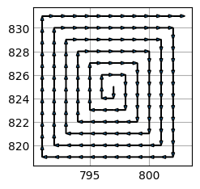
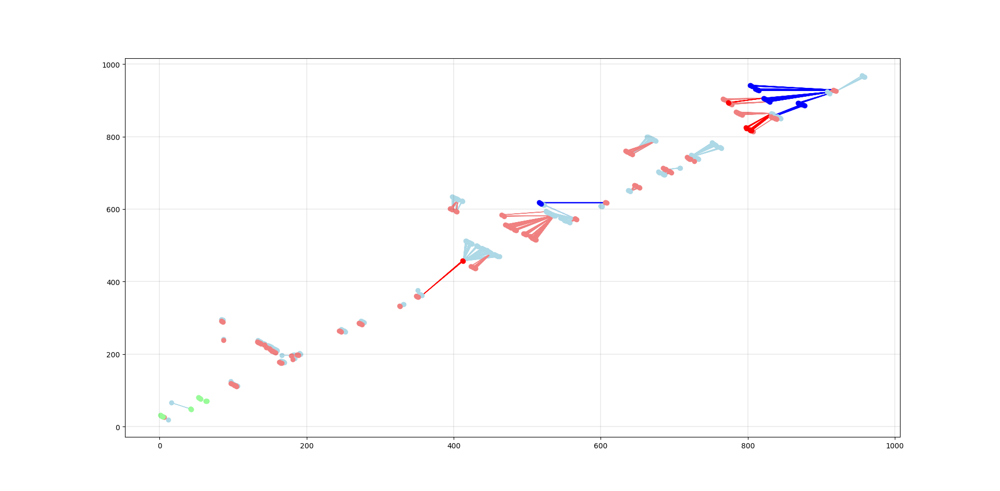

# This is a chronological changelog for AptaMat

### WEEK 1 - 02/09/2024 -> 08/09/2024.

#### CHANGELOG

- Created AptaFast.py to separate the original algorithm from its optimised counter part.

- Added a compressed cache to store distances already calculated.
    
    The coordinates are hashed to an hexadecimal number then stored into a dictionary.

    Not very effective since the avoided calculation is just two substractions for manhattan distance and a square root for euclidean method.

- Added a small optimisation to ignore testing for common points in the two matrices, returning a distance equal to 0.

- Added a spiraling search inside the matrices to optimise searching for the nearest point.

    This method returns improper results when using big matrices. Small matrices are ok.

    

    Very effective in the cases of small matrices (~two to four time faster): very big matrices almost always take more time (~100 to 1000 times slower for 1000x1000)
    
    This is due to the number of points tested being dramatically larger the bigger the matrices are and eventually surpassing the number of points tested in older versions.
    
    From [wikipedia](https://en.wikipedia.org/wiki/Nearest_neighbor_search) : "The simplest solution to the NNS problem is to compute the distance from the query point to every other point in the database, keeping track of the "best so far". This algorithm, sometimes referred to as the naive approach, has a running time of O(dN), where N is the cardinality of S and d is the dimensionality of S. There are no search data structures to maintain, so the linear search has no space complexity beyond the storage of the database. Naive search can, on average, outperform space partitioning approaches on higher dimensional spaces."
        This is what's hapening here.
    
- Added this changelog.

#### FUTURE CHANGES AND IDEAS

- Optimising the search for the nearest point. 
    
    Determining if an approximate method is still satisfactory for big matrices.

    Using multiprocessing since the search for the nearest point for each point are completely independant.
    
    Determining the matrices of smallest distances for all points and using it directly in the calculations.
    
### WEEK 2 - 09/09/2024 -> 15/09/2024.

- Implemented multiprocessing to process all the nearest points calculations.
    - VERY effective in the case of bigger matrices. (720s to 40s on a 48 cores CPU with 1000x1000 matrices)
    
    - Now, the load is distributed across *n* cpu cores, *n* being chose by the user (with an educated prompt).

- Implemented double list search in place of spiraling search.

    - This type of search uses the properties of naive search on sub matrices centered around the originating point. Since the points are very dispersed in the matrices, there's a good chance to find the closest one near the originating point.
    
    - With multiprocessing, it is around 2x faster for small matrices (~20x20 and a pool of 2 cores) and also 2x faster for bigger matrices (~1000x1000 and a pool of 4 cores).
    
    - For bigger matrices, this method still returns wrong results but for smaller ones it gives good results. I still don't know why, it requires further debugging.
    
    - **METHOD EXPLANATION** 
        - For each points to be tested, we create two lists from the same starting list of candidates (*struct2*). The first one is sorted by the X coordinates and the second by the Y coordinates.
        - We insert the originating point in the lists at the right places and we take its index.
        - We test a certain number of points around the middle point created by the originating point and put them in two separated lists for X and Y coordinates. This number of points represent the length of the submatrice tested. This "*search_depth*" (aka. the number of points taken around the middle point) is determined by the length of the array tested (length <10 : depth = length/2 ELSE depth=10). 
        - We then keep the intersection between these two arrays and now we have three use cases:
            1. There are no points in the intersection array: we start again with a bigger submatrice.
            2. There is a single point in the intersection : this is the closest point and we keep it.
            3. There are several points : we test the individual distances and keep the smallest one.
 
    - We found out why the results given by bigger matrices are wrong.
    
        - With a simple visualisation tool, we highlighted the points where the distance calculated is wrong, i.e. where the search for the closest point is wrong:
        
        
        - In this screenshot, we can see:
            - In red and blue : the points respectively from the first structure and the one compared.
            - in light blue and light red are the distances correctly calculated.
            - In green : the common points between the two structures.
            - The arrows point to the nearest point calculated by our new method.
            
        - We now give a new screenshot which is centered around the point [413,457]
            
            - In green : the search list sorted by the X coordinates.
            - In yellow : the search list sorted by the Y coordinates.
            - The intersection is pointed to by the arrow from the originating point.
                - Unfortunately, it is not the nearest point. 
                - This is due to the immediate proximity of a cluster of points which flaws the search.
            - To solve this problem, we need a bigger searche depth. (It was set to ten)
        
        - How to determine a good value for the search depth?
            - We have some ideas : 
                - Since clusters of points seem to indicate for a larger depth, we could find a way to calculate an index for points disparity.
                - This index needs to be calculated rapidly and reliably.
                
            
            
    
#### FUTURE CHANGES AND IDEAS

