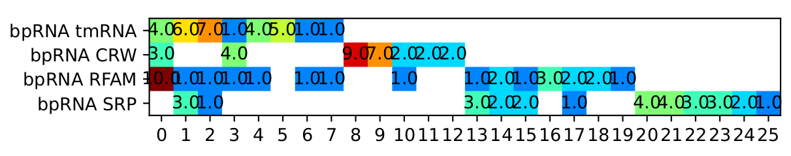
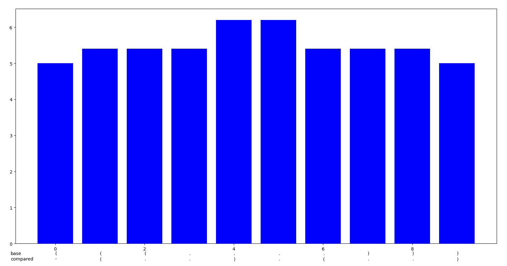

# This is a chronological changelog for AptaMat

### WEEK 1 - 02/09/2024 -> 08/09/2024.

#### CHANGELOG

- Created AptaFast.py to separate the original algorithm from its optimised counter part.

- Added a compressed cache to store distances already calculated.
    
    The coordinates are hashed to an hexadecimal number then stored into a dictionary.

    Not very effective since the avoided calculation is just two substractions for manhattan distance and a square root for euclidean method.

- Added a small optimisation to ignore testing for common points in the two matrices, returning a distance equal to 0.

- Added a spiraling search inside the matrices to optimise searching for the nearest point.

    This method returns improper results when using big matrices. Small matrices are ok.

    

    Very effective in the cases of small matrices (~two to four time faster): very big matrices almost always take more time (~100 to 1000 times slower for 1000x1000)
    
    This is due to the number of points tested being dramatically larger the bigger the matrices are and eventually surpassing the number of points tested in older versions.
    
    From [wikipedia](https://en.wikipedia.org/wiki/Nearest_neighbor_search) : "The simplest solution to the NNS problem is to compute the distance from the query point to every other point in the database, keeping track of the "best so far". This algorithm, sometimes referred to as the naive approach, has a running time of O(dN), where N is the cardinality of S and d is the dimensionality of S. There are no search data structures to maintain, so the linear search has no space complexity beyond the storage of the database. Naive search can, on average, outperform space partitioning approaches on higher dimensional spaces."
        This is what's hapening here.
    
- Added this changelog.

#### FUTURE CHANGES AND IDEAS

- Optimising the search for the nearest point. 
    
    Determining if an approximate method is still satisfactory for big matrices.

    Using multiprocessing since the search for the nearest point for each point are completely independant.
    
    Determining the matrices of smallest distances for all points and using it directly in the calculations.
    
### WEEK 2 - 09/09/2024 -> 15/09/2024.

- Implemented multiprocessing to process all the nearest points calculations.
    - VERY effective in the case of bigger matrices. (720s to 40s on a 48 cores CPU with 1000x1000 matrices)
    
    - Now, the load is distributed across *n* cpu cores, *n* being chose by the user (with an educated prompt).

- Implemented double list search in place of spiraling search.

    - This type of search uses the properties of naive search on sub matrices centered around the originating point. Since the points are very dispersed in the matrices, there's a good chance to find the closest one near the originating point.
    
    - With multiprocessing, it is around 2x faster for small matrices (~20x20 and a pool of 2 cores) and also 2x faster for bigger matrices (~1000x1000 and a pool of 4 cores).
    
    - For bigger matrices, this method still returns wrong results but for smaller ones it gives good results. I still don't know why, it requires further debugging.
    
    - **METHOD EXPLANATION** 
        - For each points to be tested, we create two lists from the same starting list of candidates (*struct2*). The first one is sorted by the X coordinates and the second by the Y coordinates.
        - We insert the originating point in the lists at the right places and we take its index.
        - We test a certain number of points around the middle point created by the originating point and put them in two separated lists for X and Y coordinates. This number of points represent the length of the submatrice tested. This "*search_depth*" (aka. the number of points taken around the middle point) is determined by the length of the array tested (length <10 : depth = length/2 ELSE depth=10). 
        - We then keep the intersection between these two arrays and now we have three use cases:
            1. There are no points in the intersection array: we start again with a bigger submatrice.
            2. There is a single point in the intersection : this is the closest point and we keep it.
            3. There are several points : we test the individual distances and keep the smallest one.
 
    - We found out why the results given by bigger matrices are wrong.
    
        - With a simple visualisation tool, we highlighted the points where the distance calculated is wrong, i.e. where the search for the closest point is wrong:
        
        
        - In this screenshot, we can see:
            - In red and blue : the points respectively from the first structure and the one compared.
            - in light blue and light red are the distances correctly calculated.
            - In green : the common points between the two structures.
            - The arrows point to the nearest point calculated by our new method.
            
        - We now give a new screenshot which is centered around the point [413,457]
            
            - In green : the search list sorted by the X coordinates.
            - In yellow : the search list sorted by the Y coordinates.
            - The intersection is pointed to by the arrow from the originating point.
                - Unfortunately, it is not the nearest point. 
                - This is due to the immediate proximity of a cluster of points which flaws the search.
            - To solve this problem, we need a bigger search depth. (It was set to ten)
        - for the example above, a search depth of a minimum of 26 is required. (tested manually)
        - How to determine a good value for the search depth?
            - We have some ideas : 
                - Since clusters of points seem to indicate for a larger depth, we could find a way to calculate an index for points disparity.
                - This index needs to be calculated quickly and reliably.
    
        - For now, we don't know how to calculate this depth.
            
        - **Successfuly implemented double list search.**
        
        - The structures used in this example are:
        "(((((......(...[..).......)))).).........((....))...((((......((.]...)).....))))...((((.........(((((..(((.....)))..))))....)........(((((..(((...(((.((((((((((....({((((......)))))[[(...).(((....}]]))).......)))))))..))))))...)))..)))).)...)....(((((((........))))))).....(((((........)))))..)))..................................((....))............(..((((....))))..........).....................(.(((((((....((...((((.(((((.....(((....(((((.(((.((((...((((((.(......)))))))..)).)))..)))))))....)))....))))).))))..((((((((.(((((((.((((((......(((..((((..(((....))).))))...)))....)))))).))))))).....(((....))).))))))))...))..))))))).)..((((........))))..........(((.(((((((((..(((...((((......))))...)))...((....))........(((((...(((....)))....))))).(((((((....(((...)))....)).))).))....))))))))).)))..((.(...((((((.....((((((((((.(((....(((((((....))))))).....)))...(((..((.((........)))).)))..).))))))))).(.((.......))...)..))))))......).))............(.(((....))).)......." 
        and
        "((((((...................))))).).........((....))...((((......((.....)).....))))...((((.........((..(((((.....)))))..).)............((((((...((.((..((((((((.(....((((........))))[[(...).(((.....]])))....).)))))..)))..)).....))..))))))....)....((((..............)))).....(((((......)))))..)))..................................((....))...............((((....))))..................................((((....((.......((.........(..(((((.....))))).)..............))......(..(((.(((.((((..((((.........(((((....(((((((((..)))))))..))...))))).......))))...)))).))).).......(((....))).....))..)........))....))))...(((........)))..............(((.(((..(..(.(...((.....))...).)..................(.(((...((((....))))....))).)...(.((((....(....)....))).).).......)..))).))).....((.(...((((((.....(((((((((....((...((((.(......).))))...).).....(.(..((((........)))).).)....)))))))))....................))))))......).))...........(.(.(....).).).........................."
        
        They are purposefully complicated and long to represent a worst case scenario.
        
- The new verbose mode:  
    - Speed of the algorithm with verbose mode enabled:
        - Since the old approach printed out the nearest point found as it was calculated, the calculation needed to wait for the sentences to be printed (this meant that a 0.5s calculation would take ~6s when everything was printed out)
        - With the new approach, the nearest point found are printed at the end of the calculation with the distance value.
        - This allows for a more efficient calculation in verbose mode and it nearly doesn't impact peformances.
    - What is said:
        - When verbose mode is enabled, it indicates when a pool of cores is created and terminated and with how much cores.
        - At the end of the calculation, every nearest point found is printed neatly with an indication of the cache used and the distance calculated.
        - When inverting the structures, it indicates that the algorithm is creating a new pool of cores and changing the base structure.

- Added a random weighted structure file generator.
    - This creates a .fa file with a certain number of structures (default: 100).
    - There are parameters to control the appearance of the structures (density, bias...)
    
- Further optimised the program to create a unique pool of cores for all calculations.


- **ADVICE ON NUMBER OF CORES TO USE**
    
    - When testing a large number of big structures we recommend using a maximum of *6* cores.
    
    - When testing a large number of small structures, we recommend *4* cores.
    
    - When testing a very small number of structures, without taking into account the scale of the structures, always use *2* cores.
    
    - *SPEED COMPARISON*:
        - For a random weighted structure file with 100 structures of length 500:
            -  With 6 cores, we go from 20s of calculation with AptaMat to 6s with AptaFast.
            
        - In general, expect a 2 to 5 times improvement on speed regardless of file size, structure number and length.
        
- **SEARCH_DEPTH CALCULATION**
    
    - We chose to determine empirically the best depth for each matrix size. How did we do it?
        1. We tested the accuracy of AptaFast for matrix sizes of 10, 25, 50, 75, 100, 250, 500 and 1000.
            - For each size, we tested the search_depth limit at which the program started to give improper results.
                - We used a randomly generated set of 1000 dotbracket structures for each size. (density = 0.5; bias = 0.6)
        2. We plotted the result on a graph and chose a linear regression to have a depth for each size value.
            - Here is this plot with all the regression parameters:
            
            
            
            - The exact points plotted were:
            
            |X|Y|
            |:-----:|:-----:|
            |10|3|
            |25|4|
            |50|5|
            |75|5|
            |100|6|
            |250|7|
            |500|9|
            |1000|13|
            
        3. We now have a mathematical equation to calculate the search_depth with respect to the length of the structure: *depth = 0.009125 x length + 4.207*
            - For security purposes, we added 2 to the result to counter the rounding error.
        
    - Adding a new `-speed` parameter.
        - When using the program on 1000x1000 non-aligned matrices taken from a real database, we found a minimal search depth to be 26, not 13 as given by the equation.
            - That is why we decided to add a "speed" parameter defaulted to "slow" which determines the greedyness of the algorithm regarding the depth.
            
        - When set to slow (**recomended**) the program doubles the search_depth given by the equation to counter extreme cases.
        
        - Why the name 'speed' and not 'greedyness' ?
            - because lowering the depth of search theoretically improves the calculation speed.
            - In reality it *MIGHT* improve speed by a little when comparing very big structures.
                - When testing a file with 10000 weighted structures of length 100 on 6 cores, we saw no difference in speed whether the speed was set to "slow" or "quick".
                - That is why we chose "slow" as default. 
        
- **WARNING** :
    - It seems important to specify that, for all the performance tests, we used the random structure generator which generates structures impossible to find in real life.

#### FUTURE CHANGES AND IDEAS

- Improving the random structure generation to create realistic dotbracket notation for performance tests.
    
- Taking a look at [GPU optimisation](https://developer.nvidia.com/how-to-cuda-python)

- Taking a look at the placement of gaps and the minimisation of the AptaMat distance.
    - starting development of an alignment tool for the minimisation of the distance.
    
- **IF POSSIBLE**:
    - improving the speed of file reading in the case of very big files.
        - improving ram use in the case of big files.


### WEEK 3 - 16/09/2024 -> 22/09/2024.

- Succesfully divided RAM usage by at least 8 when parsing a file.
    - using uint8 (1byte) instead of default float64 (8bytes) when parsing a file.
    - This greatly improved speed on very big structures (from 214s to 175s for 250 5000-length structures)
    - We see no difference in speed when calculating distance for intermediate to smaller structure for aptafast.
    - Parsing file may be faster but there is a need to find a better way to calculate the dotplot matrix or even completely bypass the matrix and going from dotbracket to coordinates directly.

- Changed the way random_gen.py behaves to generate more realistic structures and to be more reliable and quick.
    - Now, seeing this pattern is impossible : `()`
    - We adjusted the bias and density parameters.
    - the verify function now tests the length of the returned structure.
    
- Supplementary performance test with realistic randomly generated structure files:
    - It seems that with smaller structures, the change in matrix size altered the speed of aptafast in a bad way when comparing it with aptamat which contradicts what we saw last week.
        - You can expect aptafast to be around 1.5 to 2 times slower. We still don't know why it happens and we need to do more tests.
    - For bigger structures, we see a real difference:
        - with 5000 1000-length weighted structure file, we see these results:
        
        |/|SPEED|RAM USAGE|
        |:-----:|:-----:|:-----:|
        |SPEED 'SLOW'|434s|8.2Go|
        |SPEED 'QUICK'|334s|8.2Go|
        |APTAMAT|1077s|45.3Go|
        
    - additionnal tests need to be conducted for smaller structures (under 100-length) and for accuracy.

- Successfuly implemented a faster file parser using a dictionnary and partial search.
    - Expect a 1.33 times improvement of file parsing speed for all files.
    - Accuracy is perfect, expect no coordinates errors.
    
- Completely optimized file parsing with multiprocessing.
    - If "quick" mode is selected, the program WILL use all the cores of the cpu.
    - If "slow" mode is selected, the program will use half the cores of the cpu.
    
    - We saw an immediate improvement in overall speed:
        - for a file with 1000  1000-length structure, we went from 130.21s to 61.37s (quick mode and 6 cores for calculations)
            - The file parsing took 5s instead of 70s.

- **First finished version of AptaFast without gpu optimization.**

**CLEANING**

- Deleted Cache because it slowed things down.

- Cleaned the program for a better efficiency.
    - Now, calculation_core and calculation_core_naive handles the verbose mode and only returns the distance found, not the point.
        - There is now no need to recalculate the distances when the pool of cores has finished.
    - Verbose mode can be very unorganised since all the cores dumps their results on the screen as it is calculated.
    
- Using Naive search because of better performances for structures under 250 of length. (please see performances tests below)

##### NEW PERFORMANCE TESTS:

We tested 67 use cases with files of 10 000 structures of length ranging from 100 to 1000. All the times are in seconds.
We also tested with 2, 4 and 6 cores, every time with the "SLOW", "QUICK" or naive method.


- In this screenshot of the tests, we have colored the cells line per line, so colors from any line are completely independant from another.
    - We can see here how and when AptaFast becomes faster than AptaMat in each use cases. And also where using naive search in Aptafast is completely equivalent to the double list search.
    - We can also see when naive search becomes slower: at around 250 in length, this is where we switch methods in the program.
    
    


- In this one, the colors in all cells are corelated. We can see how AptaFast is more homogeneous in its speed than AptaMat.

- How to explain the sudden pics in time ?
    - Since we used the same files for each lines, we can assume that we encountered some kind of "structural extreme" where the program encounters a worst case scenario for one of its mode (hence the pics for 2 cores at 250 length).
    
    
**TEMPORARY CONCLUSION ON PERFORMANCE**

- AptaMat is substantially faster than aptafast for smaller structures.
    - This surely comes from the fact that singlethreaded performance is very important in the case of AptaMat. 
    - Moreover, when calculating with a very small number of points, the naive implementation is still faster because there is a sequence of very small and efficient operations that are very fast when running sequentially.
    - When calculating bigger structures, the double-list method becomes faster because the number of points to be tested in the naive implementation is enormous.
    

- AptaFast's naive implementation is not conclusively faster than the double list search for smaller structures.
    - It is still bound by the management of CPU cores, even if it's the exact same method used in AptaMat.
    - We still want to use it for smaller structure since the double list search becomes completely identical to the naive search (especially in the "SLOW" mode).
        - Why? : Because there is less instructions and less variables manipulated by the program in naive mode.
      
    
#### FUTURE CHANGES AND IDEAS

- **Making a definitive aptafast implementation with:**
    - multiprocessing
    - GPU optimizing using PyCuda
    - Naive + double list search

- **HOW:**
    - Having the search for the nearest point be done by the GPU for each point.
    - Implementing multiprocessing at a higher level:
        - At the structure level and not point level.
            - This means that we would allocate the comparison for a structure on a single thread which will call the GPU for the nearest point search.
    - Using Naive search or double list search with a threshold using the GPU.


### WEEK 4 - 23/09/2024 -> 29/09/2024.

**First Release of AptaFast**

- We have know a definitive implementation of AptaFast with overall algorithmic optimization and multiprocessing.

- Some improvement could still be made regarding multiprocessing depth. Do we use it on a *per point* basis or *per structure* basis ? Testing still needs to be made.

- Accuracy testing needs to be conducted on a more automated and higher level.

**No GPU optimization**
- We decided to abandon GPU optimization since it would be a problem for portability.

**Definitive accuracy and speed testing**

- Here is the updated performance test with an accuracy test:


- We tested 10 new sets of 100 to 1000 length structures. There were 1000 structures in each of them.

- The time now takes into account the file parsing time as well as the calculation time.

- Accuracy and average deviation are calculated by taking to average of the accuracy (in %) and the average of the average devation for each pass.

- We can see that, the bigger the structure is, the worse the accuracy becomes. BUT, the average deviation stays really small which is satisfactory.

- SO:
    - If you want the best accuracy and speed, we reccomend using the "SLOW" mode with 6 cores.
    - If you want the best speed regardless of perfect accuracy, use the "QUICK" mode with 6 cores.

**Changes in clustering**

- Started understanding, fixing and cleaning clustering.

- Updated file paths to Aptafast and aptamat.

- Added CPU and GPU accelerated functions to view the affinity matrix using matplotlib and vispy.
    - GPU function still work in progress.
    
- Cleaned a bit more.

- Finished GPU accelerated affinity matrix visualizator.
    - We can see the figures created by both histogram methods:
    


- The histogram created with matplotlib, CPU accelerated.
    


- The histogram created with vispy, GPU accelerated with an openGL implementation.
    
- The CPU implementation is very slow especially to turn in 3D space.

- The GPU implementation may be a bit less readable but faster to display and explore.

- Adapted AptaFast to work with the clustering algorithm.
    - Clustering is two times faster.

#### FUTURE CHANGES AND IDEAS

- Implementing an alignement tool to minimize the AptaMat distance and making AptaMat more independant.
    - First, naive implementation by testing all the possibilities.
    - Then possible algorithmic optimization.
    - In the end, maybe using a genetic algorithm.

### WEEK 5 - 30/09/2024 -> 06/10/2024

- Finished cleaning up the clustering algorithm.

- `clustering_AptaMat.py` is to be used in the command line.

- Work in progress : adding a way to visualize errors in the clustering to prepare for alignement.

- Added a depth argument to control the number of times the affinity propagation is calculated with recursive parameters.

- Finished cleaning and fixing the clustering algorithm.


#### FUTURE CHANGES AND IDEAS

- Implementing an alignement tool to minimize the AptaMat distance and making AptaMat more independant.
    - First, naive implementation by testing all the possibilities.
    - Then possible algorithmic optimization.
    - In the end, maybe using a genetic algorithm.
    
### WEEK 6 - 07/10/2024 -> 13/10/2024    

- Finished gap paenalty tests.

- Added AptAlign

- Added the bruteforce alignment method (very slow but optimal).
    - To be used with VERY small structures (max size 15 with 5 gaps to be usable)
    
- parallelized the distance calculation for the brute force method.

**DATASETS ALIGNMENT TESTS WITH DIFFERENT GAP IMPLEMENTATION**

- We have conducted tests to know whether adding a gap penalty is a good strategy for future developments.

- First, let's see the dataset used to make all these tests:
    - There were 4 families of structures used from the bpRNA database.
        - tmRNA
        - CRW
        - RFAM
        - SRP
    - each of these families had 29 structures for an affinity_matrix of size (29*4)^2 = 13456.
        - There is enough structures and families to have significant results and not too many to have a relatively small calculation time (1min40s average)
        
- *Results*:
    - We tested three naive gap placements with 7 gap penalty values: 0, 1, 5, 10, 100, 500 and 10000.
        - Random gap placement, gaps are placed randomly.
        - Starting gap placements, all the gaps are placed at the start of the structure.
        - Ending gap placements, all the gaps are placed at the end of the structure.
    - For the random gap placements, we ran the algorithm three times on each penalty values except for 10000.
    - We ran all the simulations with two depths values : 10 (default) and 100.
    
*You can see the full results and the raw database in the repository in clustering/tests/*

- First, let's see the baseline results without gaps:

|DEPTH|10|100|
|:-----:|:-----:|:-----:|
|Results|||

- We can immediatly see that increasing the depth refines the precision and inverses the dispersion.
    - BUT it also exacerbates the false positives or the underlying tendencies of the dataset regarding the AptaMat distance.

- We need to be careful when using a bigger depth, that's why the default is set to 10.

- Results viewed with ascending gap penalty:

|METHOD|RANDOM|RANDOM|START|START|END|END|
|:-----:|:-----:|:-----:|:-----:|:-----:|:-----:|:-----:|
|PENALTY/DEPTH|10|100|10|100|10|100|
|0|||||||
|1|||||||
|10|||||||
|500|||||||

- What can we see ?

- Adding a gap penalty might be useless as it increases the number of clusters and dispersion, and decreases the precision and reliability of the results.
- It was expected to see that adding gaps with no penalty at the end of the structures yields no difference with the no gaps tests.
- It is interesting to see that placing gaps might cancel false positives in the clustering (like the small cluster of bpRNA SRP at the first column almost disappearing at the cell random_gaps_depth=100_penalty=1 and completely disappearing at the cost of bigger dispersion at the cell random_gaps_depth=100_penalty=0).

- So, there is a big interest in using gaps for alignment but the penalty added might be useless.


**Strategy to make a good alignment algorithm ?**

- Brute force : optimal but really intensive and not a good idea for very big structures.

- Dynamic programming : good for solving sub problems but not optimal.

- Genetic algorithm : training an algorithm for placing the gaps that is good with all types of structures.

- Pattern recognition : might be the best of all solutions.

#### FUTURE CHANGES AND IDEAS

- Making an alignment algorithm that minimize the aptamat distance.

### WEEK 7 - 14/10/2024 -> 20/10/2024

- Fixed the brute force search.

- Added a new function to evaluate the placement of a single gap between two structures.

- Added functions in file_parser_cluster.py to convert from FASTA files to CLUSTER files and the over way around.

- Added a first order dynamic alignment function.

**TESTING IMPACT OF THE PLACEMENT OF A SINGLE GAP**

We will test the impact of the placement of a single gap by calculating the AptaMat distance for each possible position of the gap within a tested structure. We will be using the same reference structure for each tests.

What structures to use ?

We will be using small, medium and large structures.

- Small:
    - Reference: `(((....)))`
    - Tested: 
        1. `((.....))`
        2. `(..).(..)`
        3. `((..(.)))`
        
- Medium:
    - Reference: `((((((((..(.(((((.....[[))))).)[.....)]((((((]].....))))))..)))))))` (Purine_riboswitch    6UC7_B.pdb)
    - Tested:     
        1. `(((((((..(.(((((.....[[))))).)[.....)]((((((]].....))))))..)))))).` (Purine_riboswitch    2XNZ_A.pdb with an added dot at the end to match the size)
        2. `(((..((((....[...)))).(((((.......)))))....(((((..]....))))))))...` (tRNA    6RFL_U.pdb with added dots at the end to match the size)
        3. `(((((([..(.(((((.{{{.{{))))).)(.....])((((((}}()}}}))))))..)))))).` (bpRNA_PDB_247 with added dot at the end)
        
- Large:
    - Reference: `(((((((.............((((((((.(...((((...((((((((([[[[[..(.(((((.]]]]].....))))).)................................(..(.((((((((..)))))))).)..)....((((((.((....)).))))))...(.....((.......))......)...............................................(((((.((...((([.[.[[[)))....)))))))..........]]]...].]...)))))...))))...))))..).))))))))...(((((.......))))))))))))....` (bpRNA_tmRNA_6 from `data_clustering_4_families_non_aligned.dat`)
    - Tested:     
        1. `(((((((............(((((((.((((((((((((((..((((([[[[(((((]]]]....)))))...............................(((((((.........)))))))((((((((((((((..[[[[[[[))))))))).))))).......]]]]]]]...(((((((((((.[[[[[[[))))))))))).........]]]]]]]..((((..(((.(((.[[[[[[[)))..)))..))))..........]]]]]]]...))))).....))))))..).))))))))))))))...(((((.......))))))))))))................` (bpRNA_tmRNA_28 with dots at the end to match the sizes)
        2. `.................(((..(((((................................((((.........))))................................))))))))......(((......((((((((.((...(((((((.((((....(((((((....))))))).....)))).....(((....)))....((....)).)))))))..))))))))))(((..(.(((..((((((((.......))))))))))).....))))..((((((((....))))...))))))).((((((..........))))))..........................` (bpRNA_CRW_7727 with dots at the end to match the sizes)
        3. `.....(((.(((((((((...[[[[.((((((((((.....)))))(((((....)))).)((...(((((...........(((((((((((((((((((((((((((.((((((((((((.....))))))))))))............)))))))))))))))))))))))))..)).......((((((.......))))))((((((((......))))))..)).)))..)))))))))))))...((((.....(((((....((((.]]]]))))))))).....))))......((((((((....))))))))...........................)))))))).` (bpRNA_RNP_398)

- SMALL RESULTS:

|REF-1|REF-2|REF-3|
|:-----:|:-----:|:-----:|
||||


- MEDIUM RESULTS:

|REF-1|REF-2|REF-3|
|:-----:|:-----:|:-----:|
||||

- LARGE RESULTS 

|REF-1|REF-2|REF-3|
|:-----:|:-----:|:-----:|
||||

- Let's zoom in on the second and third results for the large tests:

|REF-2|REF-3|
|:-----:|:-----:|
|||


- What do these results show ?
    - The homogeneous penalty applied with the insertion of a gap seems appropriate. We don't see any kind of tendencies in the results.
    - When the results are displayed, the gaps are placed where it minimizes the AptaMat distance.
    - When we see a certain trend in results (like in the medium results) it indicates high correlation between the two structures tested; i.e. they are very similar.
    

**DATASETS ALIGNMENT TESTS WITH DIFFERENT GAP IMPLEMENTATION (CONTINUATION)**

- Please refer to the results obtained in WEEK6 to have context.

- We want now to test clustering with:
    - the same dataset BUT aligned with RNAlign2D.
    - Another dataset with more structures and more families.
        (Objective: 10 families with 150 structures)


- RESULTS with the same dataset but aligned with RNAlign2D `(depth=100, gap_penalty=1)`.

|SimpleMode|PseudoMode|
|:-----:|:-----:|
|||

- The worse results come from the fact that my dataset implements structures of varying sizes which can be significant when differentiating them.
- We will need to use a better dataset with better choosen structures and families.

#### TO DO LIST:

- Making a new and bigger dataset with more correlated data for clustering and alignment tests.

- Programming pattern recognition to align structures.

### WEEK 8 - 21/10/2024 -> 27/10/2024
    
- Testing the new alignment method : 
    - Seems to be A LOT faster than the brute force method. Obviously doesn't give optimal results but are they better than not aligning ?
    
- Results with two random structures (chosen purposefully big and complicated). Based on real structures but troncated.
    `RESULT FROM DYNAMIC ALIGNMENT`
    `........(((((...[[[.))))).((((.((((((.(((((((((....(((.(((.((((((..(.(((..((((((((...))))))))))).....))))..((((((((.))))...))))))).((((((.)))))).((((....))))...)))))).).....(.(((...(((((.))))).)))).)).)))))).((((([[[...(((((.....((.]]])).)))))))))).))))))))))..((([[...(.((((.(.(((.(((((((.(((((((((((....(((((((..)))))))..)))))))))..)))))))))...(((((((((..)))))).)))...))))..))))..((((((.....]]....))))))))))...]]]`
    `....(((((((((..((((((....))))))..((......))))))))))).((.((((..(((((((((...(((((((((....)))..((((......))))..)))))).....((((.(((((((...((..(((......)))))....)))))))..((((((((.....)))))))).....))))....)))).)))...))))))))..............................(((((((...(((((..((...(((....)))...))....)))))...)))))))......(...((((((((........))))))---)-------------)...-----------------------------)............................`
    `39.979`
    
    `RESULT FROM BRUTE FORCE ALIGNMENT`
    `DID NOT FINISH: used all the ram before even comparing. (64GB of RAM + 140GB of swap)`
    `BRUTE FORCE IS NOT A GOOD METHOD WHICH WAS EXPECTED`
    
- Seems to be working great with small structures!

**DATASETS ALIGNMENT TESTS WITH DIFFERENT GAP IMPLEMENTATION (CONTINUATION)**

- Difficulties with making a new dataset: we don't have enough differentiated dotbracket files to test.
    - Created a webscraper to extract structures from the miRBase database website.
    
- The tests were inconclusive with the scraper, we would need a dataset with actual RNA families and not organised by specie.
    - (Please navigate to clustering/tests/Test2/ to see the actual data)

- With the old dataset, we can't seem to find the same results. It becomes even worse when trying to align the dataset.
    - (Please navigate to clustering/tests/Test3/ to see the actual data)
    - We also tried with a higher recursion depth but nothing interesting came out.
    
### WEEK 9 - 28/10/2024 -> 03/11/2024

- Implemented a new web scraper to scrape families from the BPRNA database.

- literature search for existing alignment methods and algorithms.
    - MARNA
    - bpRNAlign
    - MUSCLE...
    
- Further optimised clustering algorithm tomake the clustering calculation quicker : parallelization.
    - Around 2 to 3 times faster than older versions.

- Renamed depth argument in clustering to `sigma_range` and added a new `depth` argument to actually control the range.

**DATASETS ALIGNMENT TESTS WITH DIFFERENT GAP IMPLEMENTATION (END)**

- New test with the new scraper :
- With 8 families of 150 structures, without any alignment: (depth = 100)
    
    


```
RF00001= 5S ribosomal RNA
RF00004= U2 spliceosomal RNA
RF00005= tRNA
RF00010= Bacterial RNase P class A
RF00015= U4 spliceosomal RNA
RF00020= U5 spliceosomal RNA
RF00023= transfer-messenger RNA
RF00162= SAM riboswitch aptamer (S box leader)
```

- With the same dataset, RNAligned (depth = 100).


- We can see that using the alignment tool greatly reduces the accuracy of the clustering. The length delta between structures seems to be important to differentiate families. AptaMat seems to take that into account.
- Still, the clustering results are not very good.

- Last results: with very high precision parameters (sigma_range = 10000; depth = 1000): (9h40min of run time)


- The clustering algorithm still didn't converge and we see little to no improvement.

### WEEK 10 - 04/11/2024 -> 10/11/2024

- Added base classes to control an OOP based alignment:
    - `Structure`
    - `Pattern`
    - `Separator`

- Added the `slicer()` function to create and divise patterns and separators from the sequence.

- Added the `subdiv_finder()` function to detect structure-wide subdivisions.
    - Replaces the affected parentheses with hashtags and added a new index for future alignment : `subdiv_index`.

- Rewritting of the `slicer()` function is finished.
    - It is now faster and less clunky. (using dictionnaries instead of strings)
    
- Updated the `Structure.reagglomerate()` function in order to support the new subdiv characters. 

- Further tests of the dynamic alignment showed that is gives the same results as the bruteforce method for small patterns (less than 20 of size).
    - It has also shown that giving a little bit of wiggle room for same-size patterns in term of alignment can give better results. (1 of wiggle room is recomended).
    - With very different structures, it also showed that it gives exactly the same results as the bruteforce method (at least in terms of distance minimization).
    
- With those new tests, I can confidently say that this new alignment method will be close to but not optimal in regards to the aptamat distance.

- Created a precise method for alignment:

```
 ____________________
 METHOD:
     
     MATCHING
     
     - comparing number of patterns
     - comparing number of separators
     
     - comparing one by one the length and distance of the patterns and separators.
         - taking into account subdivisions with the subdiv_index.
     
     - Having a one by one match with all the patterns of the smallest structure.
         - A matched pattern in the bigger structure cannot have a smaller order than its match in the smaller structure.
         - If the number of pattern is the same in both structure, there is a single way to match each pattern.
         
     ALIGNING
     
     - Using dynamic alignment to align each pattern with its match.
         - mark them as aligned and input each other in the `self.alignedwith` variable.
     
     - When done, match the length of the two structures with gaps placed in the separators where it minimizes the distance.
     
     - Mark the structures as aligned and input each other in the `self.alignedwith` variable.
 ____________________
```

- Added new functions to run the alignment:
    - `pattern_alignment` to run an alignment between two patterns and translate all the other patterns higher in the hierarchy.
    - `separator_compensating` to run the last alignment operation on the separators.
    - `matching_finder` to evaluate the best pairing between patterns in the structures. *(WIP)*
    - `added_gaps` to propagate the effects of adding gaps in all of the next elements.

- Added the possibility to have empty separators.
    - Each structure are now always formed by an alternating sequence of patterns and separators.
    - An empty separator have a starting position of -1 and en ending position corresponding to the start of the next element.
    
- Added new functions to run the last step of the alignment : separator gap insertion:
    - `sep_gap_adder` to add a certain number of gaps and updates the next patterns and separators.
    - `sep_gap_inserter` to run the actual last alignment operation.


### TO DO LIST:

- Making an alignment algorithm with a structural alphabet.
    - Making the matching pattern function.
    - acounting for subdiv.
    - Testing with pseudoknots.

- Organising the AptAlign.py algorithm.
    - Adding a main function to use the algorithm in the terminal.
    - Adding a pairing function for alignement of a batch of structures in a file.